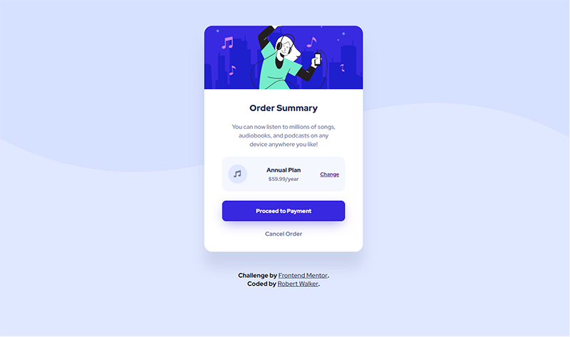

# Frontend Mentor - Order summary card solution

This is a solution to the [Order summary card challenge on Frontend Mentor](https://www.frontendmentor.io/challenges/order-summary-component-QlPmajDUj). Frontend Mentor challenges help you improve your coding skills by building realistic projects. 

## Table of contents

- [Overview](#overview)
  - [The challenge](#the-challenge)
  - [Screenshot](#screenshot)
  - [Links](#links)
- [My process](#my-process)
  - [Built with](#built-with)
  

**Note: Delete this note and update the table of contents based on what sections you keep.**

## Overview

### The challenge

Users should be able to:

- See hover states for interactive elements

### Screenshot

### Links

- Solution URL: [Add solution URL here](https://your-solution-url.com)
- Live Site URL: [Github](https://robertwalker68501.github.io/order-summary-component/)

## My process

### Built with

- Semantic HTML5 markup
- SCSS
- Flexbox
- Font Awesome
- Mobile-first workflow

## Author

- Website - [https://www.walker-designs.com](https://www.walker-designs.com)
- Frontend Mentor - [@robertWalker68501](https://www.frontendmentor.io/profile/robertWalker68501)
- Twitter - [@RobertW15135868](https://www.twitter.com/@RobertW15135868)